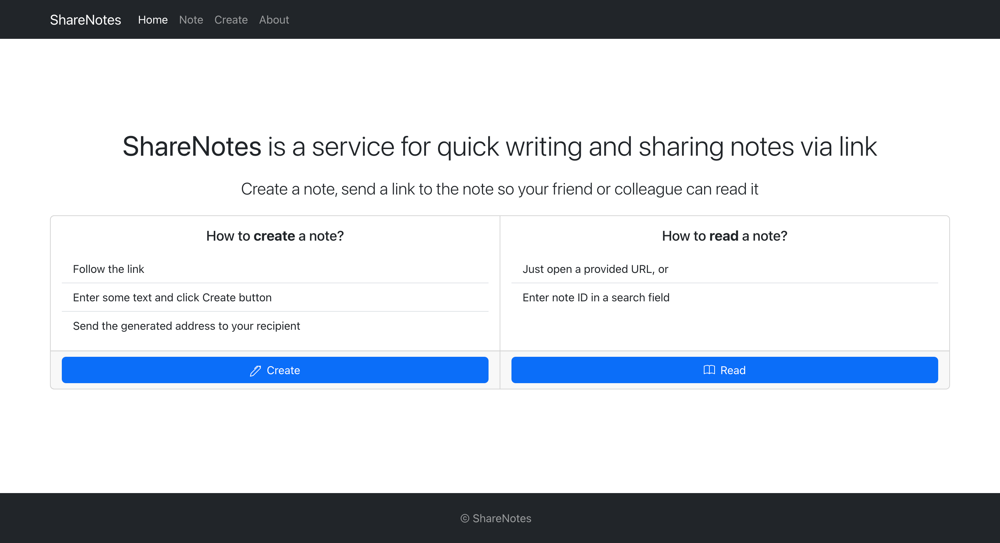
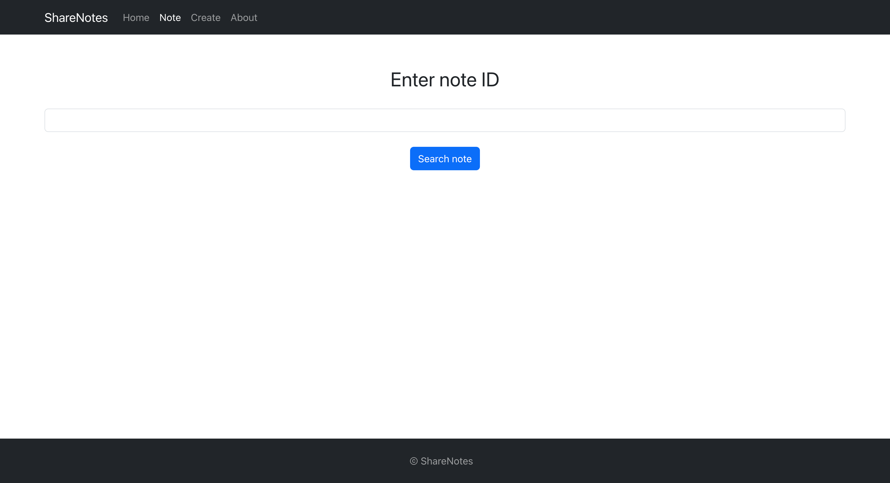
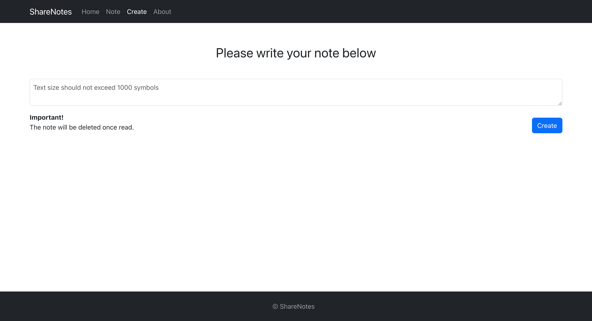
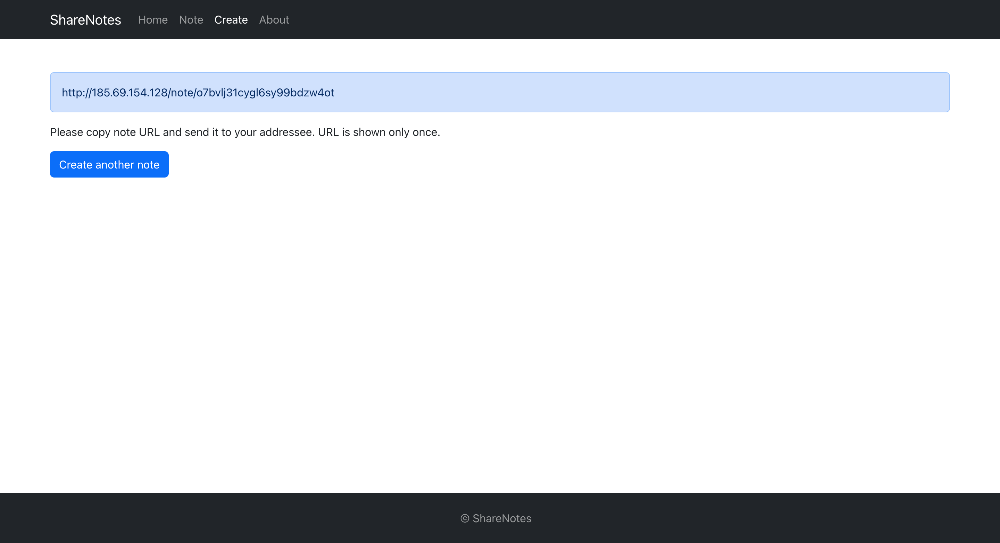
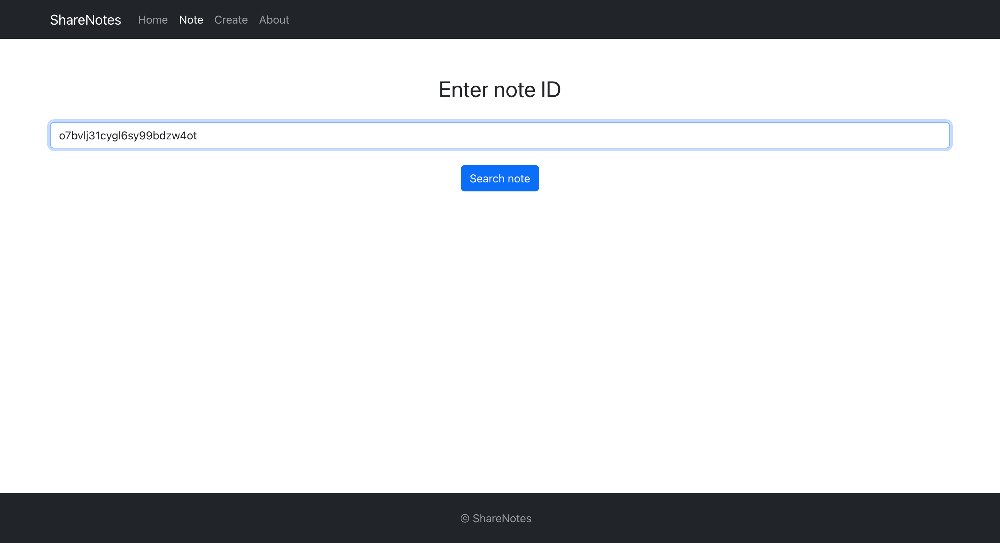
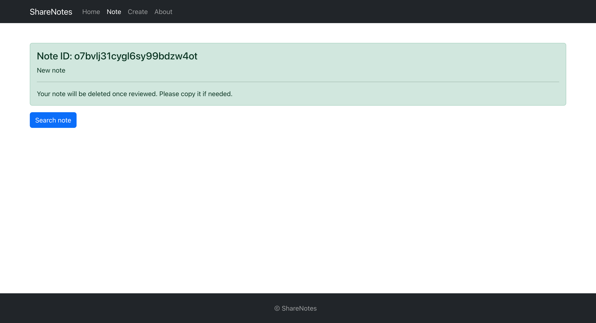
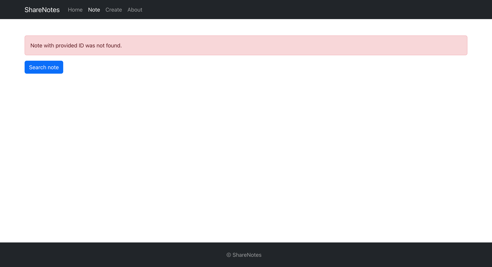
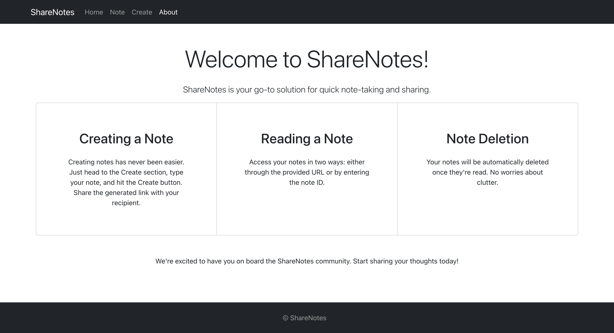

# ShareNotes

## Overview

ShareNotes is a service for quick writing and sharing notes.

## Features

- **Create a note**: you can go to Create section and input your note in a text field. Click on Create button and it is done, your note is created. Once created, you will see note URL on a screen. Please copy URL and send it to your adressee so they can read your note. Keep in mind that URL will be shown only once so make sure to copy it. Otherwise, you will not be able to access your note.

- **Read a note**:
  There are 2 ways to acess your note:

1. Using URL. For instance, http://sharenotes/note/pnezclswqv6gdrbbohklymlt, or
2. Using note ID. Note ID is the last part of URL. In the example above note ID is pnezclswqv6gdrbbohklymlt.

To read a note using **URl** just copy link to search bar of your browser.
To read a note using note **ID**, please go to Note section and enter note ID.

- **Deletion**: the note will be deleted once read.

## Technologies Used

- React
- Bootstrap

## Live Demo

Check out the live demo [here]('http://185.69.154.128/').

## Preview

